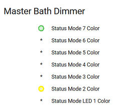
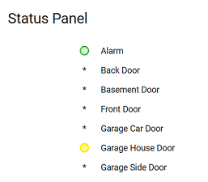
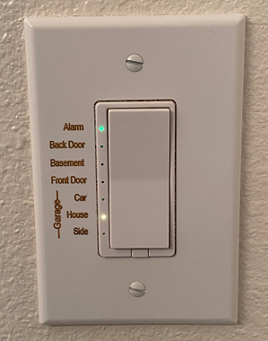

# **Home Assistant Configuration**

## **Security Camera Stuff**
I have the following camera related components installed in my configuration.

| Component            | Description                            | Notes                             |
| -------------------- | -------------------------------------- | --------------------------------- |
[rtsp-simple-server](https://github.com/aler9/rtsp-simple-server) | "rtsp-simple-server is a ready-to-use and zero-dependency RTSP / RTMP / HLS server and proxy, a software that allows users to publish, read and proxy live video and audio streams." | This proxy is used so that multiple streams do not overwhelm less capable (cheap) cameras. It runs in Docker independently of Home Assistant, in fact it is running on an old Raspberry Pi. |
[Frigate NVR Add-on](https://github.com/blakeblackshear/frigate) | "A complete and local NVR designed for Home Assistant with AI object detection. Uses OpenCV and Tensorflow to perform realtime object detection locally for IP cameras." | This adds object detection for even cheap cameras (without running it in the cloud), so that events can be triggered based on a person moving rather than leaves and shadows moving. The Google Coral USB Accellerator gives enough performance to run this on a Raspberry Pi. |
[Frigate Integration](https://github.com/blakeblackshear/frigate-hass-integration) | Integrates Frigate with Home Assistant. | Configures all entities to control Frigate and receive updates. Frigate publishes event information in the form of a change feed via MQTT. |
[Wyse Cam V2](https://wyze.com/wyze-cam-v2.html) | A cheap indoor camera with audio. | Using the [alternate Wyse RTSP firmware](https://download.wyzecam.com/firmware/rtsp/demo_4.28.4.51.bin) to access the camera stream locally. I experimented with the [Xiaomi Dafang Hack](https://github.com/EliasKotlyar/Xiaomi-Dafang-Hacks), which was interesting, but could not get any more reliability than the Wyze firmware. |
[Amcrest AD110 Video Doorbell](https://amcrest.com/smarthome-2-megapixel-wireless-doorbell-security-camera-1920-x-1080p-wifi-doorbell-camera-ip55-weatherproof-two-way-audio-ad110.html) | Good quality video doorbell with local RTSP communication and two-way audio. | Have not had any problems with it. |
[amcrest2mqtt](https://github.com/dchesterton/amcrest2mqtt) | A simple app to expose all events generated by an Amcrest device to MQTT using the [python-amcrest](https://github.com/tchellomello/python-amcrest) library. | Has entities for things like amount of storage used on the SD card, but there is nothing essential that it provides that I have used so far. |
[packages/security_camera.yaml](https://github.com/rodpayne/home-assistant/blob/main/.homeassistant/packages/security_camera.yaml) | Configuration and automations | |
[www/camera_video.html](https://github.com/rodpayne/home-assistant/blob/main/.homeassistant/www/camera_video.html) | This webpage displays the video from a security camera.  It uses a variety of technologies to find one that will work in a particular browser and keeps it running. | Can be used in a Lovelace [Webpage (iframe) card](https://www.home-assistant.io/lovelace/iframe/) or panel, as an [iframe-fullscreen custom panel](https://www.technicallywizardry.com/home-assistant-custom-panels/), or stand-alone in a browser.  |


## **Lovelace HomeSeer WD200+ Card**
This card shows the status of the seven LEDs on the HS-WD200+ dimmer switch connected using `zwave_js`. The color and blinking of the LEDs are set as configuration parameters of the Z-Wave device and the current `zwave_js` integration does not reveal them in attributes of a sensor (yet?), so this was kind of a challenge for me.

The code is at: [www/homeseer-wd200-status-card.js](https://raw.githubusercontent.com/rodpayne/home-assistant/main/.homeassistant/www/homeseer-wd200-status-card.js)

With a very basic configuration it looks like this:


```yaml
    cards:
      - type: "custom:homeseer-wd200-status-card"
        entity_id: light.node_20
```

Adding a few configuration options makes it look like this:



```yaml
    cards:
      - type: "custom:homeseer-wd200-status-card"
        entity_id: light.node_20
        title: Status Panel
        labels:
          - "Garage Side Door"
          - "Garage House Door"
          - "Garage Car Door"
          - "Front Door"
          - "Basement Door"
          - "Back Door"
          - "Alarm"
```          
FYI, this is what my installed dimmer switch looks like:



### **Manual Installation Hints**
<details>
  <summary> Click for Details</summary>

I wish there were an easy way to explain how to add a custom card.  Some of it depends on whether you are configuring Lovelace in YAML or in the dashboard.  It would be easy if I restructure my repositories for installation using HACS, which I will probably do one of these days.

Manually:

1. Create a `www` subfolder under your `config` folder if there isn't one there already.
2. Copy [homeseer-wd200-status-card.js](https://raw.githubusercontent.com/rodpayne/home-assistant/main/.homeassistant/www/homeseer-wd200-status-card.js) to the `config/www` folder.
3. Add a resource entry.  This is where it gets complicated depending on how you are set up.
4. Reload Resources in the dashboard.
5. Add a card configuration.

Resource entry example in `configuration.yaml` if using YAML mode:
```
lovelace:
  mode: yaml
  resources:
    - url: /local/homeseer-wd200-status-card.js
      type: module
```  
For UI (non-YAML) mode:
1. Click your name in the lower-left corner to get your profile.
2. Turn on `Advanced Mode`.
3. Go to `Settings` > `Dashboards` > click the three dots menu and pick `Resources`.
3. Click `Add Resource` and add the resource.
If you get "You are using your dashboard in YAML mode...", then do it like the YAML mode example.
</details>

## **Set State**
Python Script to set the state or other attributes for the specified entity.

Excellent documentation and HACS installation available from (https://github.com/xannor/hass_py_set_state) readme.

### **Manual Installation Hints**
1. Create `<config>/python_scripts` folder if you haven't already.

2. Copy `set_state.py` into the `<config>/python_scripts` folder.

3. Add `python_script:` to `<config>/configuration.yaml` if you haven't already.

4. Restart Home Assistant.

## **Person Location Custom Integration**


This custom integration has been moved to its own HACS-compatible repository.

### **Combine the status of multiple device trackers**
This custom integration will look at all device trackers for a particular person and combine them into a single person location sensor, `sensor.<name>_location`. Device tracker state change events are monitored rather than being polled, making a composite, averaging the states, or calculating a probability.

### **Make presence detection not so binary**
When a person is detected as moving between `Home` and `Away`, instead of going straight to `Home` or `Away`, this will temporarily set the person's location state to `Just Arrived` or `Just Left` so that automations can be triggered appropriately.

### **Reverse geocode the location and make distance calculations**
When the person location sensor changes it can be reverse geocoded using Open Street Maps, Google Maps, or Open Street Map and the distance from home (miles and minutes) calculated with `WazeRouteCalculator`.

### **[Open repository README](https://github.com/rodpayne/home-assistant_person_location#home-assistant-person-location-custom-integration) for all available installation and configuration details.**
