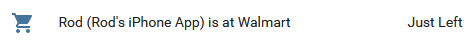
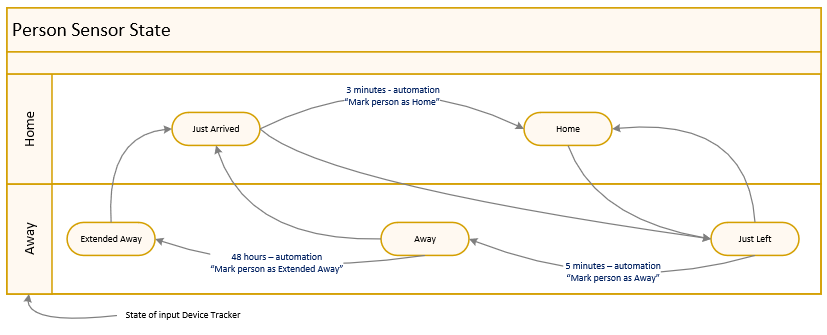
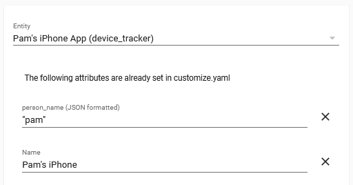

# Person Detection Details

## Table of Contents

* [Objectives](#objectives)
  * [Combine the status of multiple device trackers](#combine-the-status-of-multiple-device-trackers)
  * [Make presence detection not so binary](#make-presence-detection-not-so-binary)
  * [Reverse geocode the location and make calculations](#reverse-geocode-the-location-and-make-calculations)
* [Components](#components)
  * [File automation_folder/person_location_detection](#file-automation_folderperson_location_detectionyaml)
    * [Device tracker requirements (input)](#device-tracker-requirements-input)
    * [Person location sensor example (output)](#person-location-sensor-example-output)
  * [Service person_location/process_trigger](#service-person_locationprocess_trigger)
  * [Folder custom_components/person_location](#folder-custom_componentsperson_location)
    * [Open Street Map Geocoding](#open-street-map-geocoding)
      * [Open Street Map Geocoding Configuration](#open-street-map-geocoding-configuration)
    * [Google Maps Geocoding](#google-maps-geocoding)
      * [Google Maps Geocoding Configuration](#google-maps-geocoding-configuration)
* [Installation](#installation)   
  * [Manual installation hints](#manual-installation-hints) 
  * [Configuration parameters](#configuration-parameters) 
  * [Lovelace Examples](#lovelace-examples)
* [Back to README](/README.md#home-assistant-configuration)
## Objectives


### **Combine the status of multiple device trackers**
This custom integration will look at all device trackers for a particular person and combine them into a single person location sensor, `sensor.<name>_location`. Device tracker state changes are monitored rather than doing polling, averaging the states, or calculating a probability. 
Device trackers follow a device that the person has; the person location sensor tries to follow the person instead.

### **Make presence detection not so binary**
When a person is detected as moving between `Home` and `Away`, instead of going straight to `Home` or `Away`, it will temporarily change the person's status to `Just Arrived` or `Just Left` so that automations can be triggered or conditions applied appropriately.



*Inspired by <https://philhawthorne.com/making-home-assistants-presence-detection-not-so-binary/>* 

### **Reverse geocode the location and make calculations**
The custom integration supplies a service to reverse geocode the location (making it human readable) using either `Open Street Map` or `Google Maps` and calculate the distance from home (miles and minutes) using `WazeRouteCalculator`.  

## Components

### **File automation_folder/person_location_detection.yaml**
This automation file contains the example automations that call the person_location/process_trigger service.  These automations determine which device trackers will be watched for events that will trigger processing. 

Automations `Mark person location as Home`, `Mark person location as Away`, and `Mark person location as Extended Away` each need to have the complete list of Person Trackers.  (A future enhancement may find a way to maintain the list automatically.) 

Automation `Person Location Update` contains a list of device tracker entities to be monitored. Automation `Person Location Device Tracker Updated` looks at all `state_changed` events to find the ones that belong to device trackers. One automation or the other (or both) will be needed to select the input to the process.

Note that `Person Location Update for router home` and `Person Location Update for router not_home` are not currently used by me because it drives my router crazy to be probed all the time.  The intention here was to give a five minute delay before declaring the device not home, so that temporary WIFI dropoffs do not cause inappropriate actions.

#### **Device tracker requirements (input)**
Each device tracker that is processed needs to have the identity of the person that is being tracked. This is specified in either a `person_name` or `account_name` attribute of the device tracker. This could be done in Configuration Customizations.



In the case of the [Apple iCloud integration](https://www.home-assistant.io/integrations/icloud/), the account_name can be specified in its configuration and this gets passed thru to the device trackers:
```yaml
# Example configuration.yaml entry for iCloud presence

- platform: icloud
  username: roderickhpayne@gmail.com
  password: !secret icloud_rod
  account_name: Rod
```

### **Service person_location/process_trigger** 
This is the service that is called by automation `Person Location Update` following a state change of a device tracker such as a phone, watch, or car.  It creates/updates a Home Assistant sensor named `sensor.<personName>_location`.
	
The sensor will be updated with a state such as `Just Arrived`, `Home`, `Just Left`, `Away`, or `Extended Away`.  In addition, selected attributes from the triggered device tracker will be copied to the sensor.  Attributes `source` (the triggering entity ID), `reported_state` (the state reported by the device tracker), `icon` (for the current zone), and `friendly_name` (the status of the person) will be updated.
	
Note that the person location sensor state is triggered by state changes such as a device changing zones, so a phone left at home does not get a vote for "home".  The assumption is that if the device is moving, then the person has it.  An effort is also made to show more respect to devices with a higher GPS accuracy.

If you prefer the selection priority that the built-in Person integration provides, only call the person_location service for the `person.<personName>` tracker rather than the upstream device trackers.  Do not mix the two.

#### **Person location sensor example (output)**

| Entity              | State | Attribute Name | Example         | Description |
| :------------------ | :---: | :------------- | :-------------- | :---------- |
| sensor.rod_location | Home	| source_type:   | gps | `source_type` copied from device tracker |
|                     |       | latitude:      | xx.136566162109375 | `latitude` copied from device tracker |
| | | longitude: | -xxx.60774422200406 | `longitude` copied from device tracker |
| | | gps_accuracy: | 65 | `gps_accuracy` copied from device tracker |
| | | altitude: | xxxx.1041374206543 | `altitude` copied from device tracker |
| | | vertical_accuracy: | 10 | `vertical_accuracy` copied from device tracker |
| | | friendly_name: | Rod (Rod's iPhone) is Home | formatted location to be displayed for sensor |
| | | source: | device_tracker.crab_apple | device tracker that triggered the state |
| | | reported_state: | Home | `state` reported by the device tracker |
| | | update_time: | 2020-12-11 17:08:52.267362 | time that the device tracker was updated |
| | | icon: | mdi:home | icon for the zone of the location |


### **Folder custom_components/person_location**
For meaningful results, the device trackers will need to include `latitude` and `longitude` attributes, as in Mobile App, iCloud, and iCloud3 device trackers.  The location features will be skipped for updates triggered by device trackers that do not know the location coordinates.  

By default, the custom integration will add the following attribute names to the sensor.

| Attribute Name            | Example | Description |
| :------------------------ | :------ | :---------- |
| meters_from_home: | 71862.3 | calculated distance from Home (meters) |
| miles_from_home: | 44.7     | calculated distance from Home (miles) |
| direction: | stationary     | direction from Home |
| driving_miles: | 50.6       | distance from Home based on Waze route |
| driving_minutes: | 46.8     | distance from Home based on Waze traffic conditions |
| location_latitude: | xx.136533521243905 | saved for next calculations |
| location_longitude: | -xxx.60796996859035 | saved for next calculations |
| location_update_time: | 2021-01-31 21:14:28.071609 | saved for next calculations |

*Attribution:* "Data provided by Waze App. Learn more at [Waze.com](https://www.waze.com)"

#### **Open Street Map Geocoding**
The Open Street Map Geocoding feature adds the following attribute names to the sensor.

| Attribute Name            | Example | Description |
| :------------------------ | :------ | :---------- |
| OSM_location: | 1313 Mockingbird Lane Hollywood Los Angeles California 90038 United States | `display_name` from Open Street Map |
| friendly_name: | Rod (Rod's iPhone) is in Los Angeles | formatted location to be displayed for sensor |

Open Street Map (Nominatim) has [a usage policy](https://operations.osmfoundation.org/policies/nominatim/) that limits the frequency of calls. The custom integration attempts to limit calls to less than once per second, possibly skipping an update until the next one comes along.  To meet the requirement to be able to switch off the service, the state of `person_location.person_location_api` can be changed to `Off`. This can be done by calling service `person_location.geocode_api_off` and then resumed later by calling service `person_location.geocode_api_on`.  The number of calls is also reduced by skipping updates while the person location sensor state is `Home` or if the location has changed by less than 10 meters.  (It will update while the state is `Just Arrived`, so it will reflect the home location while home.)

If you find problems with the OSM information, feel free to sign up at https://www.openstreetmap.org/ and edit the map. 

*Attribution:* "Data © OpenStreetMap contributors, ODbL 1.0. https://osm.org/copyright"

#### **Open Street Map Geocoding Configuration**
To activate the custom integration with the Open Street Map geocoding feature, add a contact email address to `<config>/configuration.yaml`.
```yaml
# Example configuration.yaml entry
person_location:
    osm_api_key: !secret gmail_address
```

#### **Google Maps Geocoding**
The Google Maps Geocoding feature adds the following attribute names to the sensor.

| Attribute Name            | Example | Description |
| :------------------------ | :------ | :---------- |
| google_location: | 1313 Mockingbird Ln, Los Angeles, CA 90038, USA | `formatted_address` from Google Maps |
| friendly_name: | Rod (Rod's iPhone) is in Los Angeles | formatted location to be displayed for sensor |

*Attribution:* 

#### **Google Maps Geocoding Configuration**
To activate the custom integration with the Google Maps Geocoding feature, add a Google API Key to `<config>/configuration.yaml`. A Google API Key can be obtained from the [Google Maps Platform](https://cloud.google.com/maps-platform#get-started). Unfortunately, obtaining a Key requires that billing be set up. Their free tier is generous for our purposes, but if it gives you the heebie-jeebies to give Google a credit card, stick with Open Street Map.
```yaml
# Example configuration.yaml entry
person_location:
    google_api_key: !secret google_api_key
```
## Installation
### **Manual Installation Hints**
1. Create `<config>/python_scripts` folder if you haven't already.

2. Add `python_script:` to `<config>/configuration.yaml` if you haven't already.

3. Copy the components into the appropriate folder under `<config>`.

4. Update file `<config>/automation_folder/presence-detection.yaml` as appropriate for your devices.  This file may need to be placed elsewhere or merged into `<config>automation.yaml`, depending on how your configuration is organized. My configuration is split into [multiple folders](https://www.home-assistant.io/docs/configuration/splitting_configuration/).

5. Restart Home Assistant.

6. Add configuration in `<config>/configuration.yaml`.

7. Restart Home Assistant.

### **Configuration Parameters**

| Parameter | Optional | Description |
| :-------- | :------: | :---------- |
| `google_api_key` | Yes | Google API Key obtained from the [Google Maps Platform](https://cloud.google.com/maps-platform#get-started). Default: do not do the Google reverse geocoding.
| `language`       | Yes | Language parameter for the Google API. Default: `en`
| `osm_api_key`    | Yes | Contact email address to be used by the Open Street Map API. Default: do not do the OSM reverse geocoding.
| `region`         | Yes | Region parameter for the Google API. Default: `US`

If you use the iCloud3 integration, the following setting helps with showing the zone and icon when you have an apostrophe in the friendly name.
```yaml
# config_ic3.yaml
display_zone_format: fname
```
### **Lovelace Examples**

Show system information for the Person Location integration (especially during testing).
```yaml
    cards:
# ------------------------------------------------------
      - title: Person Location System Information
        type: 'custom:vertical-stack-in-card'
        cards:
# ------------------------------------------------------
          - type: entities
            entities:
              - person_location.person_location_api
            show_header_toggle: false
#
          - type: custom:entity-attributes-card
            heading_name: Attribute
            heading_state: Value
            filter:
              include:
                - key: person_location.person_location_api.*
# ------------------------------------------------------
```
Show all related device trackers and person location information (especially during testing).
```yaml
    cards:
# ------------------------------------------------------
      - type: 'custom:vertical-stack-in-card'
        cards:
# ------------------------------------------------------
        - type: custom:auto-entities
          filter:
            include:
              - entity_id: sensor.rod_location
                options:
                  secondary_info: last-changed
              - entity_id: person.rod
                options:
                  secondary_info: last-changed
              - domain: device_tracker
                attributes:
                  person_name: 'rod'
                options:
                  secondary_info: last-changed
              - domain: sensor
                attributes:
                  person_name: 'rod'
                options:
                  secondary_info: last-changed
              - domain: binary_sensor
                attributes:
                  person_name: 'rod'
                options:
                  secondary_info: last-changed
          card:            
            title: Rod's Location Devices
            show_header_toggle: false
            type: entities
#
        - type: custom:entity-attributes-card
          heading_name: Attribute
          heading_state: Value
          filter:
            include:
              - key: sensor.rod_location.*
            exclude:
              - key: sensor.rod_location.attribution
              - key: sensor.rod_location.friendly_name            
              - key: sensor.rod_location.icon
# ------------------------------------------------------
```
### [Back to README](/README.md#home-assistant-configuration)